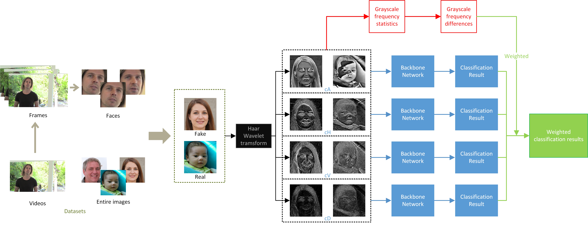

# Using Grayscale Frequency Statistic to Detect Manipulated Faces in Wavelet-Domain

[Anonymous ICML 2021 submission]
[Code For Paper ID 2572]


#   Overview


Our proposed approach consists of 4 parts: 1) extracting frames from video datasets, then detecting and aligning faces in extracted frames; 2) utilizing Haar Wavelet to obtain low-frequency approximate (it is termed as cA), horizontal detail (cH), vertical detail (cV) and diagonal detail (cD) images; 3) analyzing the differences of the GFS between the fake and real facial images in these four subband images; 4) evaluating the detection performance with binary classifiers and using GFS differences to weight the classification results to obtain weighted classification results.


#   Experiment Environment
Our source development env is shown in requirements.txt
```
pip install -r requirements.txt
```
To facilitate experiments on a specific dataset, the code of each dataset is divided into the corresponding folders


#1) Prepare Datasets
### Download Original Datasets 

Download the original datasets to the corresponding *original_datasets* folder.
* [StyleGAN](https://drive.google.com/drive/folders/1uka3a1noXHAydRPRbknqwKVGODvnmUBX) 
* [StyleGAN2](https://drive.google.com/drive/folders/1QHc-yF5C3DChRwSdZKcx1w6K8JvSxQi7) 
* [ProGAN-lsun-person](https://drive.google.com/drive/folders/15LhtIKEZo7cE69L9r2wVFIWZNrNUsfms) 
* [DeepfakeTIMIT](https://www.idiap.ch/dataset/deepfaketimit) 
* [UADFV](https://github.com/danmohaha/WIFS2018_In_Ictu_Oculi) 
* [FF++_DF](https://github.com/ondyari/FaceForensics) 
* [FF++_F2F](https://github.com/ondyari/FaceForensics) 
* [DFD](https://ai.googleblog.com/2019/09/contributing-data-to-deepfake-detection.html) 
* [DFDC](https://www.kaggle.com/c/deepfake-detection-challenge) 
* [CelebDF(V2)](https://github.com/danmohaha/celeb-deepfakeforensics) 
* [StarGAN](https://github.com/yunjey/stargan)

### Preprocess the Videos
For all video datasets (including DeepfakeTIMIT, UADFV, FF++_DF, FF++_F2F, DFD, DFDC and CelebDF(V2)), 
first extract the frames
```
cd dataprepare\extract_frames_and_faces\
python extract_frames.py
```
Then, download the [shape_predictor_68_face_landmarks.dat](http://dlib.net/files/shape_predictor_68_face_landmarks.dat.bz2)
to the *extract_frames_and_faces* folder. After that, extract and align faces from frames
```
python extract_face.py
```
(The extracted images can be controlled by modifying parameters in the source code)


#2) Perform 2D DWT while Dividing Datasets

Perform Haar wavelet transform on all images (the facial images extracted from the videos or the images completely generated by GANs) to obtain four subband images (cA, cH, cV and cD,). The corresponding 60% of each subband is divided into the training set, 20% into the validation set, and 20% into the test set (Both save in dwt_datasets folder).
```
cd dataprepare
python prepare_dwt_datasets.py
```
Note that only images from the training set are used.

### Prevent Data Leakage
For all video datasets, ensure that the images in the training set, validation set, and testing set will
not come from the same video.
```
python PreventDL.py
```


#3) GFS and  GFS Differences
Perform grayscale frequency statistic on the four subband images after wavelet transformation of true and fake images
```
cd "grayscale frequency statistic and differences"
python grayscale_frequency_statistic.py
```
The *results* folder obtained after execution saves the statistical plots of GFS and GFS differences,
as well as the *diff_mean_std.json* file that quantifies the GFS differences.


#4) Train CNNs with Four Subbands
### Train *Meso-4* Net
```
cd train_and_test
python train_Meso4.py
```
### Train *Xception* Net
```
python train_Xception.py
```
Specify which subband ('cA/', 'cH/', 'cV/', 'cD/') is used for training through the `spec_feature` parameter.
Other training parameters also can be adjusted, depending on your situation.


#5) Test
### Test with Subbands
After training and saving the model on the four subbands, the detection performance on each subband can be tested
```
cd train_and_test
python test_with_subbands.py
```
Specify the network ('Meso4', 'Xce') used for testing through the `network` parameter.

### Text with Weights
Use the quantized GFS differences of the four subbands to weight the four networks for testing
```
python test_with_weights.py
```
Specify the network ('Meso4', 'Xce') used for testing through the `network` parameter.


#6) CAM visualization
Randomly select some fake images from the datasets for CAM visualization.
Specifically, the four subband images of these fake images after wavelet transformation are input into the corresponding
trained Meso-4 models.
```
cd visualization
python visualization_Meso4.py
```

# Statement
This repository serves as example code only for ICML2021 review.

